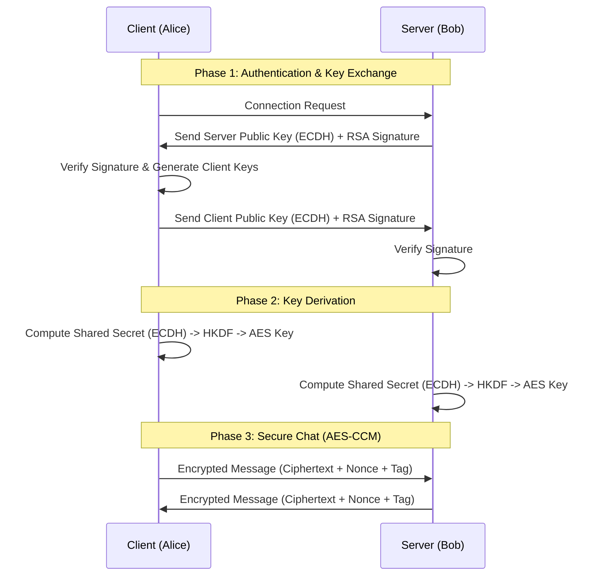

Here is the **complete, polished, and ready-to-paste** code for your `README.md` file.

I have included a **Sequence Diagram** (using Mermaid syntax, which renders automatically in VS Code and GitHub) to make it look professional.

### 📋 Instructions:
1. Open VS Code.
2. Create a file named `README.md`.
3. **Copy the code block below** and paste it into the file.
4. Press `Ctrl + Shift + V` (Windows/Linux) or `Cmd + Shift + V` (Mac) to preview it.

***

```markdown
# 🛡️ Secure Messenger — Cryptography & Network Security


## 📌 Overview

**Secure Messenger** is a Python-based encrypted chat application designed to demonstrate secure network communication concepts. It implements a **Hybrid Cryptosystem** where:
1.  **Authentication** is handled via **RSA Digital Signatures**.
2.  **Key Exchange** is performed using **Elliptic Curve Diffie-Hellman (ECDH)**.
3.  **Message Transport** is secured using **AES-CCM (Counter with CBC-MAC)**, providing both confidentiality and integrity.

This project was built for the **Cryptography & Network Security** course.

---

## 🏗️ Architecture & Handshake Flow

The application follows a secure handshake protocol before allowing chat messages.



---

## 🔐 Key Features

| Feature | Technology Used | Description |
| :--- | :--- | :--- |
| **Key Exchange** | **ECDH** (SECP256R1) | Securely derives a shared secret over an insecure channel. |
| **Authentication** | **RSA-PSS** (2048-bit) | Prevents Man-in-the-Middle (MITM) attacks by verifying identity. |
| **Encryption** | **AES-128-CCM** | Authenticated encryption ensuring message privacy and tamper detection. |
| **Key Derivation** | **HKDF + SHA256** | Converts the raw ECDH secret into a strong symmetric session key. |
| **Replay Protection** | **Nonces/Counters** | Unique nonces prevent replay attacks on encrypted packets. |

---

## 🗂️ Project Structure

```text
Crypto10/
├── crypto/                 # Core Cryptographic Implementations
│   ├── aes_ccm.py          # AES Encryption/Decryption logic
│   ├── ecdh.py             # Elliptic Curve Key Exchange
│   ├── rsa_keys.py         # RSA Key loading/generation
│   ├── secure_session.py   # Session management wrapper
│   └── signature.py        # Digital Signature verification
├── data/                   # RSA Key Storage (Generated keys)
│   ├── alice_priv.pem
│   ├── alice_pub.pem
│   ├── bob_priv.pem
│   └── bob_pub.pem
├── networking/             # Socket Programming logic
│   ├── client.py
│   ├── server.py
│   └── message_handler.py
├── logs/                   # (Optional) Chat logs
├── main.py                 # Application Entry Point
├── requirements.txt        # Dependencies
└── README.md               # Project Documentation
```

---

## 🛠️ Installation & Setup

### 1. Prerequisites
Ensure you have **Python 3.8+** installed.

### 2. Clone the Repository
```bash
git clone <repository_url>
cd Crypto10
```

### 3. Create Virtual Environment (Recommended)
```bash
python3 -m venv venv
# Windows
venv\Scripts\activate
# Mac/Linux
source venv/bin/activate
```

### 4. Install Dependencies
```bash
pip install -r requirements.txt
```

### 5. Generate RSA Keys
Before running, generate the identity keys for the Client (Alice) and Server (Bob).
```bash
# If you have a generation script:
python3 crypto/generate_keys.py
```
*Ensure `data/` folder contains: `alice_priv.pem`, `alice_pub.pem`, `bob_priv.pem`, `bob_pub.pem`.*

---

## 🚀 Usage

### Step 1: Start the Server (Receiver)
The server listens for incoming connections.
```bash
python3 main.py server
```
*Output:*
```text
[🚀] Secure Chat Server Running on 0.0.0.0:5000
[⏳] Waiting for connection...
```

### Step 2: Start the Client (Sender)
Open a new terminal and run the client.
```bash
python3 main.py client
```

### Step 3: Chatting
Once connected, the secure handshake is performed automatically.
```text
[🔑] Shared AES-CCM key derived successfully
[🔐] Secure channel established — AES-CCM enabled
[💬] Type your message and press Enter:
```
You can now type messages in either terminal. The text is encrypted before leaving the machine and decrypted only by the recipient.

---

## 🧪 Security & Logic Details

### 1. The Handshake
1. **RSA Signatures:** Both parties sign their ephemeral ECDH public keys with their long-term RSA private keys.
2. **Verification:** The receiver verifies the signature using the sender's known RSA public key (stored in `data/`).
3. **Establishment:** If verified, ECDH is used to calculate `pre_master_secret`.

### 2. The Session
* We use **HKDF (HMAC-based Key Derivation Function)** to transform the `pre_master_secret` into a 128-bit AES key.
* Messages are encrypted using **AES-CCM**, which generates an authentication tag. If a packet is modified in transit (e.g., a bit flip), the decryption will fail, alerting the user.

---

## 👨‍💻 Group Members

* **Govind**
* **Prashant Mishra**

---

## 📚 References
* [Cryptography.io Documentation](https://cryptography.io/en/latest/)
* [RFC 5116 - An Interface and Algorithms for Authenticated Encryption](https://tools.ietf.org/html/rfc5116)
* [NIST SP 800-56A - Pair-Wise Key Establishment](https://csrc.nist.gov/publications/detail/sp/800-56a/rev-3/final)
```